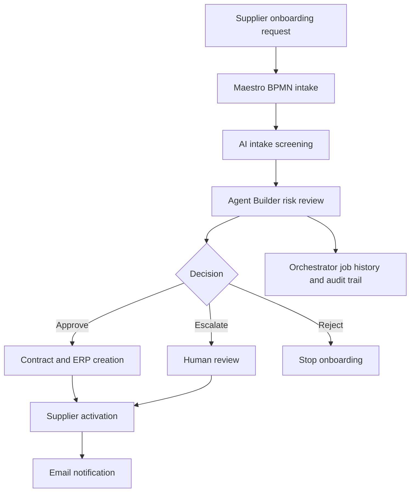

# Architecture

## Overview

Supplier Onboarding Risk Agent is a UiPath-based workflow for reviewing supplier onboarding requests with an auditable agentic decision trail.

## Components

| Layer | Component | Role |
| --- | --- | --- |
| User / business process | Procurement and compliance users | Submit or review supplier onboarding requests |
| Process orchestration | UiPath Maestro BPMN | Models intake, screening, risk review, approval, and activation |
| Agentic review | UiPath Agent Builder | Evaluates supplier packet completeness and risk |
| Execution | UiPath Orchestrator | Runs the Agent and records job history |
| Human governance | Escalation path | Handles missing, risky, or unverifiable supplier data |

## Workflow

## Agent output contract

The Agent returns structured JSON:

- `meetsBasicCriteria`
- `riskLevelAcceptable`
- `decision`
- `missingDocs`
- `riskSummary`
- `auditNotes`

## Safety behavior

If supplier packet data is missing, the Agent does not invent approval evidence. It returns `decision: "escalate"` with audit notes explaining what could not be verified.

